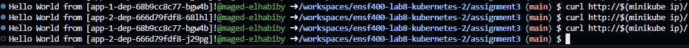
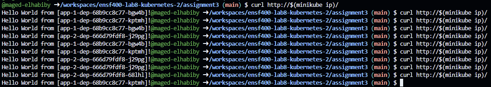
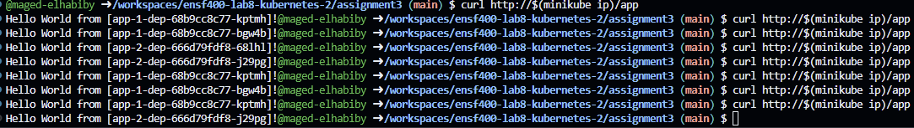

# ENSF 400 - Assignment 3 - Kubernetes - Maged El Habiby - 30144718

This assignment involves deploying an Nginx service alongside two backend applications using Minikube in Codespaces, implementing a load balancing scheme with a canary deployment for the backend services.

## Getting Started with Started

Begin by starting Minikube

```bash
minikube start
```

Enabling necessary addons:
```bash
minikube addons enable ingress
```

Set your local environment to use Minikube's Docker:
```bash
eval $(minikube docker-env)
```

Pull the required Docker images:

```bash
docker pull ghcr.io/denoslab/ensf400-sample-app:v1
```

```bash
docker pull ghcr.io/denoslab/ensf400-sample-app:v2
```

## Deployment Steps
### 1. Deploy the Nginx Configuration:
Apply the Nginx ConfigMap
```bash
kubectl apply -f nginx-configmap.yaml
```
### 2. Deploy the Nginx Service:
Deploy Nginx and expose it via a ClusterIP service:
```bash
kubectl apply -f nginx-dep.yaml
```
```bash
kubectl apply -f nginx-svc.yaml
```

### 3. Deploy Backend Applications:
Deploy the app-1 and app-2 applications and their respective services:
```bash
kubectl apply -f app-1-dep.yaml
```
```bash
kubectl apply -f app-2-dep.yaml
```
```bash
kubectl apply -f app-1-svc.yaml
```
```bash
kubectl apply -f app-2-svc.yaml
```

### 4. Testing The Load Balancer
Running The following command to make sure the load Balancer is working 50/50 between app-1 and app-2 as to show that the load balancer works as expected.
```bash
curl http://$(minikube ip)/ 
```
Output:


### 5. Configure Ingress:
Set up Ingress to route traffic to the Nginx service and configure canary deployment for app-1 and app-2:
```bash
kubectl apply -f nginx-ingress.yaml
```
```bash
kubectl apply -f app-1-ingress.yaml
```
```bash
kubectl apply -f app-2-ingress.yaml
```

### 6. Testing the Setup

* Load Balanced Access:
```bash
curl http://$(minikube ip)/
```
This should return responses alternately from app-1 and app-2, demonstrating the load balancing between the two backend services.

* Output:


* Canary Deployment Access:
```bash
curl http://$(minikube ip)/app
```
This command tests the canary deployment, where 70% of the traffic is routed to app-1 and 30% to app-2. Repeated requests should show responses primarily from app-1 but occasionally from app-2.

* Output: 


### Cleaning Up
#### 1. Deleting the Deployments
To delete all deployments and associated resources, you can execute the following commands:

```bash
kubectl delete -f nginx-configmap.yaml
```

```bash
kubectl delete -f nginx-dep.yaml
```

```bash
kubectl delete -f nginx-svc.yaml
```

```bash
kubectl delete -f app-1-dep.yaml
```

```bash
kubectl delete -f app-1-svc.yaml
```

```bash
kubectl delete -f app-2-dep.yaml
```

```bash
kubectl delete -f app-2-svc.yaml
```

```bash
kubectl delete -f nginx-ingress.yaml
```

```bash
kubectl delete -f app-1-ingress.yaml
```

```bash
kubectl delete -f app-2-ingress.yaml
```

#### 2. Deleting the Minikube environment:
```bash
minikube delete
```